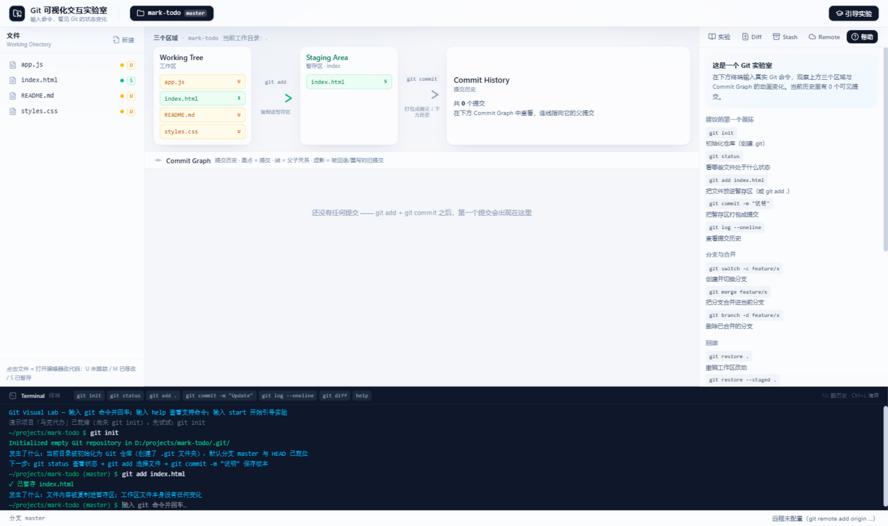
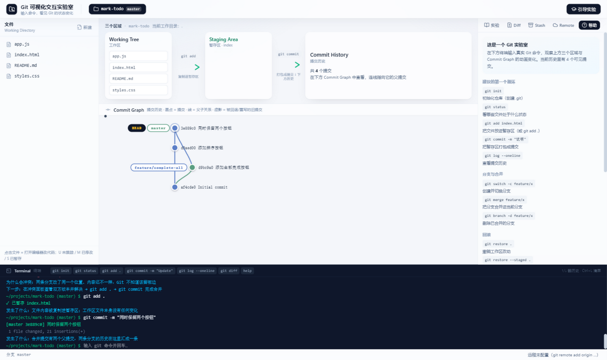
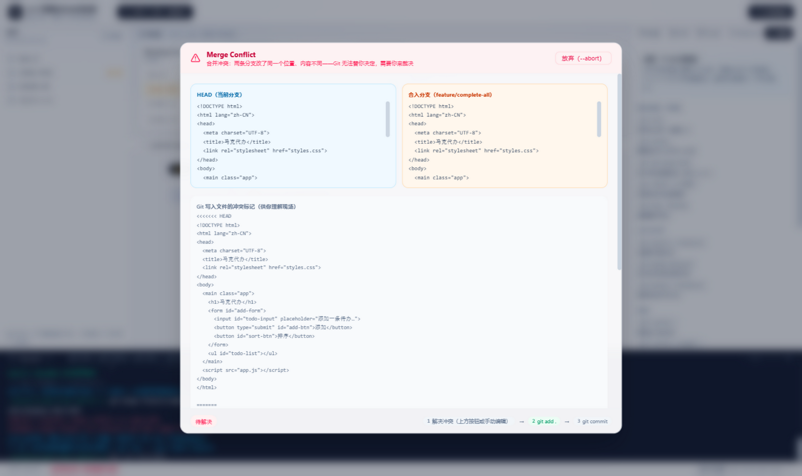
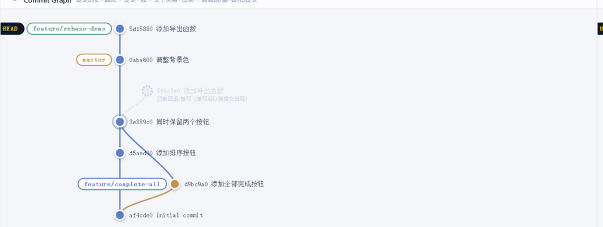

# Git 可视化交互实验室（Git Visual Lab）

> 输入真实 Git 命令 → Mini Git 引擎改变仓库状态 → UI 用动画展示状态变化 → 亲眼看见 Git 是怎么工作的。



这不是一个 Git 教程阅读网站，而是一个可以随便试、随便玩、改坏了能重来的**交互式 Git 实验室**。项目的全部教学内容来自两份本地文档（`git+github教程.md` 视频转稿与整理后的 `Git与GitHub入门教程.md`），UI 规范来自 `UI 设计.md`（工程化落地见 [docs/UI-DESIGN-SPEC.md](docs/UI-DESIGN-SPEC.md)）。

## 核心体验

- **三个区域**：Working Tree / Staging Area / Commit History，文件在区域间的移动有方向性动画（飞行芯片 + 流动箭头）。
- **Commit Graph（视觉中心）**：SVG 绘制，表达父子关系、分叉与汇合、分支标签、HEAD 位置；被 reset/rebase 挤掉的提交以"虚影"呈现，看见旧提交去了哪里。



- **合并冲突现场**：双方版本左右对照、差异行自动滚动高亮，提供"取当前 / 取对方 / 都保留 / 手动编辑"四种解决方式，走完 `解决 → git add → git commit` 的完整闭环。



- **Rebase 重放**：旧提交变虚影、逐个重放到新地基（D → D′），冲突后 `git add` + `git rebase --continue` 继续。



- **Stash / Worktree / Remote**：stash 收起未提交改动让切换不被阻塞；worktree 多目录并行但共享同一份提交历史；模拟远程演示 push / pull / clone 与 SSH Key 验证原理。
- **引导实验**：9 个分步实验（第一次存档、日常循环、分支是指针、冲突现场、后悔药、换地基、临时收起、一库多目录、推上远程），每一步校验你真实输入的命令，给出进度与提示。
- **终端**：支持命令历史（↑/↓）、快捷命令、彩色输出；错误信息对齐真实 git 风格，且失败命令绝不改变仓库状态。

## 支持的命令

```text
基础  git init / status / add <文件|.> / commit -m "说明" / log [--oneline] / diff [--staged]
配置  git config user.name|user.email <值>
分支  git branch [<名>|-d <名>] / switch <名> / switch -c <名> / checkout -b <名> / merge <名> [--abort]
回滚  git restore [.|--staged .] / reset [--hard|--mixed|--soft] HEAD~n / revert HEAD
变基  git rebase <分支> / --continue / --abort
收纳  git stash [push] / pop / list
目录  git worktree add <目录> -b <新分支> <基于分支> / list / remove <目录>
远程  git remote add origin <url> / push [-u origin 分支] / pull / clone <url> [目录]
其他  clear / help / version
```

有意不做（防止功能堆砌）：detached HEAD 完整交互、reflog、cherry-pick、tag、submodule、交互式 rebase、真实网络请求。

## 快速开始

```bash
npm install
npm run dev        # 打开终端提示的地址（默认 http://localhost:5173）
npm run build      # 生产构建（tsc + vite）
```

## 架构

```text
输入命令 → Command Parser → Git Simulation Engine（纯函数，不知道 UI 的存在）
         → 新 Repository State + Terminal Output + AnimationOperation[]
         → Zustand 单一 store → UI 从状态派生渲染
         → State Diff + ops → Framer Motion 动画
```

- `src/git-engine/`：状态模型、命令实现、解析器（纯 TypeScript，不 import 任何 React/zustand）
- `src/store/`：唯一事实来源（Zustand）
- `src/components/`：终端、文件树、三区面板、Commit Graph、冲突面板等
- `src/animation` 思想：命令只产出语义化操作（`FILE_STAGED`、`COMMIT_CREATED`、`COMMIT_REPLAYED`…），如何动由 UI 层决定
- `src/tutorial/`：实验定义与步骤校验
- 单一事实来源保证一致性：终端说成功，图上一定有变化；终端报错，状态一定没变

设计文档见 [docs/](docs/)：PRD · ARCHITECTURE · GIT-STATE-MODEL · COMMAND-SPEC（含知识点映射表）· ANIMATION-SPEC · UI-DESIGN-SPEC · ACCEPTANCE。

## 引擎测试

```bash
npx esbuild src/test/smoke.ts --bundle --platform=node --format=cjs --outfile=.tmp/smoke.cjs && node .tmp/smoke.cjs
```

85 项断言覆盖：fast-forward 不产生多余提交、merge commit 双亲、冲突全流程、reset 三模式差异、rebase 重放与 `--continue`、worktree 共享历史、push/pull/clone、gitignore、非法命令不改状态等。

## 技术栈

React 18 · TypeScript · Vite · Tailwind CSS v4 · Zustand · Framer Motion · lucide-react · 手写 SVG Commit Graph

## 后续计划

- Detached HEAD 与 reflog 的可视化
- 行级三方合并（更细粒度的冲突现场）
- 移动端/窄屏自适应布局
- 实验模式支持出错重试提示与计时
